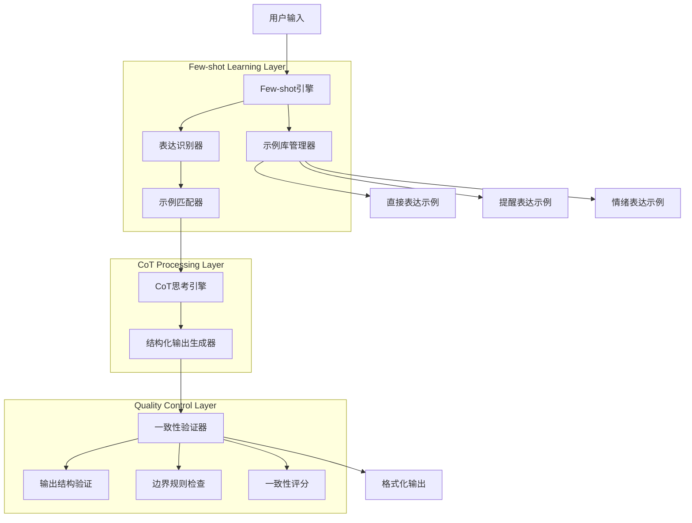
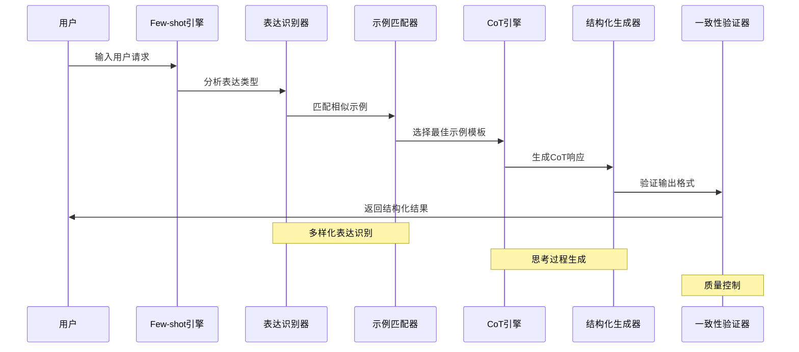

# Agent Few-shot Learning Architecture 系统架构文档

## 系统概述

**Agent Few-shot Learning** 是基于Chain of Thought的多样化示例学习系统，通过Few-shot Learning技术实现多表达变体识别和输出一致性控制。系统从Zero-shot单示例模式升级为Few-shot多示例模式，显著提升了Agent对不同用户表达习惯的理解能力和响应鲁棒性。

### 核心特性
- **多样化示例学习**: 通过3种不同表达变体训练模型理解
- **输出一致性控制**: 严格的三段式结构化输出格式
- **表达变体覆盖**: 识别直接表达、提醒表达、情绪表达等多种形式
- **边界强化机制**: 明确的输出要求和禁止行为定义
- **鲁棒性优化**: 提升对各种输入模式的适应能力

## 架构设计

### 整体架构图



### 数据流架构



## 核心组件设计

### 1. Few-shot引擎 (FewShotEngine)

**功能职责**: 统筹Few-shot学习过程的核心控制器

```typescript
export class FewShotEngine {
  private exampleLibrary: ExampleLibrary;
  private expressionRecognizer: ExpressionRecognizer;
  private consistencyValidator: ConsistencyValidator;
  
  async processFewShotRequest(
    userInput: string,
    context?: AgentContext
  ): Promise<FewShotResponse> {
    // 1. 表达类型识别
    const expressionType = await this.expressionRecognizer
      .recognizeExpression(userInput);
    
    // 2. 示例匹配和选择
    const bestExamples = await this.exampleLibrary
      .getBestExamples(expressionType, 3);
    
    // 3. 构建Few-shot提示词
    const fewShotPrompt = this.buildFewShotPrompt(
      userInput, 
      bestExamples,
      context
    );
    
    // 4. 生成CoT响应
    const rawResponse = await this.generateCoTResponse(fewShotPrompt);
    
    // 5. 一致性验证和修正
    const validatedResponse = await this.consistencyValidator
      .validateAndCorrect(rawResponse);
    
    return {
      response: validatedResponse,
      expressionType,
      usedExamples: bestExamples,
      consistencyScore: validatedResponse.consistencyScore,
      isValid: validatedResponse.isValid
    };
  }
  
  private buildFewShotPrompt(
    userInput: string,
    examples: FewShotExample[],
    context?: AgentContext
  ): string {
    const basePrompt = this.getBaseSystemPrompt();
    const examplePrompts = examples.map(ex => this.formatExample(ex)).join('\n\n');
    const contextPrompt = context ? this.formatContext(context) : '';
    
    return `${basePrompt}

## Few-shot 示例对话：

${examplePrompts}

${contextPrompt}

现在请处理用户的新请求：
用户："${userInput}"

请严格按照上述示例的格式和结构回复。`;
  }
  
  private getBaseSystemPrompt(): string {
    return `你是一个任务管理智能体，具备透明化思考能力和一致性输出控制。

## 核心工作原则：
1. **多样表达理解**: 识别不同用户表达习惯和意图
2. **结构化思考**: 展示完整的分析和推理过程
3. **一致性输出**: 严格按照指定格式输出响应
4. **边界控制**: 避免模糊语气和不必要的闲聊

## 严格输出格式要求：
每次回复必须完整包含以下三个部分：

🧠 **思考过程：**
[详细的分析和推理过程]

📋 **执行计划：**
[基于思考制定的具体行动方案]

✅ **执行结果：**
[操作执行后的明确结果说明]

## 禁止行为：
- 模糊语气（如"也许""可能""大概"）
- 重复内容或冗余表达
- 闲聊性质的回复
- 不确定或询问性语气`;
  }
}
```

### 2. 表达识别器 (ExpressionRecognizer)

**功能职责**: 识别和分类用户的不同表达模式

```typescript
export class ExpressionRecognizer {
  private expressionPatterns: Map<ExpressionType, ExpressionPattern[]>;
  
  constructor() {
    this.initializePatterns();
  }
  
  async recognizeExpression(userInput: string): Promise<ExpressionAnalysis> {
    const patterns = Array.from(this.expressionPatterns.entries());
    const scores = new Map<ExpressionType, number>();
    
    for (const [type, patternList] of patterns) {
      const score = this.calculateExpressionScore(userInput, patternList);
      scores.set(type, score);
    }
    
    const sortedTypes = Array.from(scores.entries())
      .sort(([,a], [,b]) => b - a);
    
    const primaryType = sortedTypes[0][0];
    const confidence = sortedTypes[0][1];
    
    return {
      primaryType,
      confidence,
      allScores: Object.fromEntries(scores),
      features: this.extractFeatures(userInput, primaryType),
      isAmbiguous: confidence < 0.7
    };
  }
  
  private initializePatterns(): void {
    this.expressionPatterns = new Map([
      // 直接表达模式
      [ExpressionType.DIRECT, [
        {
          keywords: ['要做', '任务', '完成', '处理'],
          patterns: [/今天要做[:：]/, /需要(做|完成)/, /要(处理|解决)/],
          structure: 'task_list',
          confidence: 0.9
        }
      ]],
      
      // 提醒表达模式
      [ExpressionType.REMINDER, [
        {
          keywords: ['记一下', '提醒', '记录', '别忘了'],
          patterns: [/记[一下]*[:：]/, /提醒我/, /别忘[了记]/, /记录一下/],
          structure: 'reminder_request',
          confidence: 0.85
        }
      ]],
      
      // 情绪表达模式
      [ExpressionType.EMOTIONAL, [
        {
          keywords: ['心情', '情绪', '烦躁', '无聊', '帮我想'],
          patterns: [/心情\w*[，,]/, /今天.*(烦|累|忙)/, /帮我想.*事/],
          structure: 'emotional_request',
          confidence: 0.8
        }
      ]],
      
      // 推荐表达模式
      [ExpressionType.SUGGESTION, [
        {
          keywords: ['建议', '推荐', '什么', '怎么办'],
          patterns: [/你觉得/, /建议我/, /推荐.*任务/, /该做什么/],
          structure: 'suggestion_request',
          confidence: 0.75
        }
      ]]
    ]);
  }
  
  private calculateExpressionScore(
    input: string, 
    patterns: ExpressionPattern[]
  ): number {
    let totalScore = 0;
    let matchCount = 0;
    
    for (const pattern of patterns) {
      // 关键词匹配得分
      const keywordScore = pattern.keywords.reduce((score, keyword) => {
        return input.includes(keyword) ? score + 0.3 : score;
      }, 0);
      
      // 正则模式匹配得分
      const patternScore = pattern.patterns.reduce((score, regex) => {
        return regex.test(input) ? score + 0.5 : score;
      }, 0);
      
      if (keywordScore > 0 || patternScore > 0) {
        totalScore += (keywordScore + patternScore) * pattern.confidence;
        matchCount++;
      }
    }
    
    return matchCount > 0 ? totalScore / matchCount : 0;
  }
  
  private extractFeatures(
    input: string, 
    type: ExpressionType
  ): ExpressionFeatures {
    return {
      hasTaskList: /[:：].+[，,、].+/.test(input),
      hasEmotionalWords: /心情|情绪|烦|累|忙/.test(input),
      hasTimeReference: /今天|明天|这周|本月/.test(input),
      hasQuantifier: /三个|几个|一些|多个/.test(input),
      isImperative: /帮我|给我|为我/.test(input),
      isQuestion: /\?|？|什么|怎么/.test(input),
      length: input.length,
      complexity: this.calculateComplexity(input)
    };
  }
}
```

### 3. 示例库管理器 (ExampleLibrary)

**功能职责**: 管理和匹配Few-shot学习示例

```typescript
export class ExampleLibrary {
  private examples: Map<ExpressionType, FewShotExample[]>;
  private similarityCalculator: SimilarityCalculator;
  
  constructor() {
    this.initializeExamples();
    this.similarityCalculator = new SimilarityCalculator();
  }
  
  async getBestExamples(
    expressionType: ExpressionType,
    count: number = 3
  ): Promise<FewShotExample[]> {
    const typeExamples = this.examples.get(expressionType) || [];
    
    // 如果该类型示例不足，补充其他类型的高质量示例
    if (typeExamples.length < count) {
      const additionalExamples = await this.getSupplementaryExamples(
        expressionType,
        count - typeExamples.length
      );
      return [...typeExamples, ...additionalExamples];
    }
    
    // 按质量分数排序并返回前N个
    return typeExamples
      .sort((a, b) => b.qualityScore - a.qualityScore)
      .slice(0, count);
  }
  
  private initializeExamples(): void {
    this.examples = new Map([
      // 直接表达示例
      [ExpressionType.DIRECT, [
        {
          id: 'direct_001',
          userInput: '今天要做：写日报、整理桌面、联系客户',
          expectedOutput: `🧠 **思考过程：**
用户列出了三个明确的任务，表达简洁直接。这些都是具体的工作任务：
1. 写日报 - 日常工作总结，通常在下班前完成
2. 整理桌面 - 工作环境整理，提升效率
3. 联系客户 - 业务沟通，需要及时处理

这三个任务优先级都比较高，应该全部添加到待办清单中。

📋 **执行计划：**
基于上述分析，我将调用三次addTodo功能，分别添加这三个任务到用户的待办清单中。

✅ **执行结果：**
已成功添加三个任务到你的待办清单中：
- 写日报
- 整理桌面  
- 联系客户`,
          expressionType: ExpressionType.DIRECT,
          qualityScore: 0.95,
          features: {
            hasTaskList: true,
            hasTimeReference: true,
            isImperative: false,
            complexity: 0.7
          }
        }
      ]],
      
      // 提醒表达示例
      [ExpressionType.REMINDER, [
        {
          id: 'reminder_001',
          userInput: '记一下：洗衣服、去超市、打电话给老妈',
          expectedOutput: `🧠 **思考过程：**
用户使用"记一下"的表达方式，说明这是一个记录提醒类的需求。列出的三个事项都是生活类任务：
1. 洗衣服 - 日常家务，需要定期处理
2. 去超市 - 采购生活用品，可能有时间要求
3. 打电话给老妈 - 亲情联系，体现关怀

这些都是重要的生活事务，需要记录在待办清单中以免遗忘。

📋 **执行计划：**
我将分别调用addTodo功能，将这三个生活任务添加到待办清单中，帮助用户进行提醒管理。

✅ **执行结果：**
已成功记录三个提醒事项：
- 洗衣服
- 去超市
- 打电话给老妈`,
          expressionType: ExpressionType.REMINDER,
          qualityScore: 0.92,
          features: {
            hasTaskList: true,
            isImperative: true,
            complexity: 0.6
          }
        }
      ]],
      
      // 情绪表达示例
      [ExpressionType.EMOTIONAL, [
        {
          id: 'emotional_001',
          userInput: '今天心情不好，帮我想三个要做的事',
          expectedOutput: `🧠 **思考过程：**
用户表达心情不好，需要我帮助规划任务来调节状态。在情绪低落时，建议安排一些：
1. 积极正面的活动 - 有助于改善心情
2. 简单易完成的任务 - 增强成就感
3. 有意义的事情 - 提升满足感

基于这个原则，我会推荐三个适合的任务。

📋 **执行计划：**
我将推荐三个有助于改善心情的任务，并通过addTodo功能添加到待办清单中。

✅ **执行结果：**
为改善心情，已为你安排三个积极任务：
- 听喜欢的音乐放松心情
- 整理房间创造舒适环境  
- 给好朋友发消息聊天`,
          expressionType: ExpressionType.EMOTIONAL,
          qualityScore: 0.88,
          features: {
            hasEmotionalWords: true,
            hasQuantifier: true,
            isImperative: true,
            complexity: 0.8
          }
        }
      ]]
    ]);
  }
  
  private async getSupplementaryExamples(
    targetType: ExpressionType,
    count: number
  ): Promise<FewShotExample[]> {
    const allExamples = Array.from(this.examples.values()).flat();
    
    // 排除目标类型，按质量分数排序
    const supplementary = allExamples
      .filter(ex => ex.expressionType !== targetType)
      .sort((a, b) => b.qualityScore - a.qualityScore)
      .slice(0, count);
    
    return supplementary;
  }
}
```

### 4. 一致性验证器 (ConsistencyValidator)

**功能职责**: 验证和确保输出格式的一致性

```typescript
export class ConsistencyValidator {
  private structurePatterns: RegExp[];
  private prohibitedPatterns: RegExp[];
  
  constructor() {
    this.initializePatterns();
  }
  
  async validateAndCorrect(
    response: string
  ): Promise<ValidationResult> {
    const structureCheck = this.validateStructure(response);
    const boundaryCheck = this.validateBoundaries(response);
    const consistencyScore = this.calculateConsistencyScore(response);
    
    let correctedResponse = response;
    let corrections = [];
    
    // 如果验证失败，尝试修正
    if (!structureCheck.isValid) {
      const structureCorrection = await this.correctStructure(response);
      correctedResponse = structureCorrection.correctedText;
      corrections.push(...structureCorrection.corrections);
    }
    
    if (!boundaryCheck.isValid) {
      const boundaryCorrection = await this.correctBoundaries(correctedResponse);
      correctedResponse = boundaryCorrection.correctedText;
      corrections.push(...boundaryCorrection.corrections);
    }
    
    return {
      originalResponse: response,
      correctedResponse,
      isValid: structureCheck.isValid && boundaryCheck.isValid,
      consistencyScore,
      structureValidation: structureCheck,
      boundaryValidation: boundaryCheck,
      corrections,
      finalScore: this.calculateFinalScore(consistencyScore, corrections.length)
    };
  }
  
  private validateStructure(response: string): StructureValidation {
    const requiredSections = [
      { name: '思考过程', pattern: /🧠\s*\*\*思考过程：\*\*/ },
      { name: '执行计划', pattern: /📋\s*\*\*执行计划：\*\*/ },
      { name: '执行结果', pattern: /✅\s*\*\*执行结果：\*\*/ }
    ];
    
    const missingSections = [];
    const foundSections = [];
    
    for (const section of requiredSections) {
      if (section.pattern.test(response)) {
        foundSections.push(section.name);
      } else {
        missingSections.push(section.name);
      }
    }
    
    const isValid = missingSections.length === 0;
    const completeness = foundSections.length / requiredSections.length;
    
    return {
      isValid,
      completeness,
      foundSections,
      missingSections,
      sectionOrder: this.validateSectionOrder(response),
      details: `结构完整度: ${(completeness * 100).toFixed(1)}%`
    };
  }
  
  private validateBoundaries(response: string): BoundaryValidation {
    const violations = [];
    
    // 检查禁止的模糊语气
    const vaguePatterns = [
      { pattern: /也许|可能|大概|或许/, type: '模糊语气' },
      { pattern: /我觉得|我认为|我想/, type: '主观表达' },
      { pattern: /应该会|可能会|也许会/, type: '不确定表达' },
      { pattern: /\?|？/, type: '疑问语气' }
    ];
    
    for (const vague of vaguePatterns) {
      const matches = response.match(vague.pattern);
      if (matches) {
        violations.push({
          type: vague.type,
          matches: matches,
          severity: 'medium'
        });
      }
    }
    
    // 检查冗余表达
    const redundancyPatterns = [
      /(.{10,})\1{2,}/g, // 重复内容
      /(总之|综上|因此).{0,20}(总之|综上|因此)/g // 重复结论词
    ];
    
    for (const pattern of redundancyPatterns) {
      const matches = response.match(pattern);
      if (matches) {
        violations.push({
          type: '冗余表达',
          matches: matches,
          severity: 'low'
        });
      }
    }
    
    const isValid = violations.length === 0;
    const severity = this.calculateViolationSeverity(violations);
    
    return {
      isValid,
      violations,
      severityLevel: severity,
      details: `发现 ${violations.length} 个边界违规`
    };
  }
  
  private async correctStructure(response: string): Promise<CorrectionResult> {
    const corrections = [];
    let correctedText = response;
    
    // 如果缺少必需的结构部分，尝试添加
    const missingSections = this.identifyMissingSections(response);
    
    for (const section of missingSections) {
      const insertion = await this.generateSectionContent(section, response);
      correctedText = this.insertSection(correctedText, section, insertion);
      corrections.push({
        type: 'structure_addition',
        description: `添加缺失的${section}部分`,
        before: '',
        after: insertion
      });
    }
    
    return {
      correctedText,
      corrections
    };
  }
  
  private calculateConsistencyScore(response: string): number {
    let score = 100;
    
    // 结构完整性 (40%)
    const structureValidation = this.validateStructure(response);
    score -= (1 - structureValidation.completeness) * 40;
    
    // 边界遵守性 (30%)
    const boundaryValidation = this.validateBoundaries(response);
    const violationPenalty = boundaryValidation.violations.length * 10;
    score -= Math.min(violationPenalty, 30);
    
    // 格式规范性 (20%)
    const formatScore = this.calculateFormatScore(response);
    score -= (1 - formatScore) * 20;
    
    // 内容质量 (10%)
    const contentScore = this.calculateContentScore(response);
    score -= (1 - contentScore) * 10;
    
    return Math.max(score, 0);
  }
}
```

### 5. 结构化输出生成器 (StructuredOutputGenerator)

**功能职责**: 根据Few-shot示例生成符合格式要求的响应

```typescript
export class StructuredOutputGenerator {
  private templateEngine: TemplateEngine;
  private contentAnalyzer: ContentAnalyzer;
  
  async generateStructuredOutput(
    userInput: string,
    examples: FewShotExample[],
    cotThought: string
  ): Promise<StructuredOutput> {
    // 1. 分析用户输入
    const inputAnalysis = await this.contentAnalyzer.analyzeInput(userInput);
    
    // 2. 选择最佳模板
    const bestTemplate = this.selectBestTemplate(inputAnalysis, examples);
    
    // 3. 生成三段式内容
    const thinkingSection = await this.generateThinkingSection(
      userInput, 
      inputAnalysis, 
      cotThought
    );
    
    const planSection = await this.generatePlanSection(
      inputAnalysis,
      bestTemplate
    );
    
    const resultSection = await this.generateResultSection(
      inputAnalysis,
      planSection.actions
    );
    
    // 4. 组装完整输出
    const structuredOutput = this.assembleOutput({
      thinking: thinkingSection,
      plan: planSection,
      result: resultSection
    });
    
    return {
      content: structuredOutput,
      template: bestTemplate,
      analysis: inputAnalysis,
      quality: await this.assessOutputQuality(structuredOutput)
    };
  }
  
  private async generateThinkingSection(
    userInput: string,
    analysis: InputAnalysis,
    cotThought: string
  ): Promise<ThinkingSection> {
    const thinkingContent = `🧠 **思考过程：**
${cotThought}

基于上述分析，我理解用户的需求是${analysis.intent}，需要处理${analysis.taskCount}个任务。`;
    
    return {
      content: thinkingContent,
      intent: analysis.intent,
      reasoning: cotThought,
      quality: await this.assessSectionQuality(thinkingContent, 'thinking')
    };
  }
  
  private async generatePlanSection(
    analysis: InputAnalysis,
    template: OutputTemplate
  ): Promise<PlanSection> {
    const actions = this.extractActionsFromAnalysis(analysis);
    
    const planContent = `📋 **执行计划：**
基于上述分析，我将执行以下操作：
${actions.map((action, index) => 
  `${index + 1}. 调用${action.tool}功能，${action.description}`
).join('\n')}`;
    
    return {
      content: planContent,
      actions,
      template: template.name,
      quality: await this.assessSectionQuality(planContent, 'plan')
    };
  }
  
  private async generateResultSection(
    analysis: InputAnalysis,
    actions: PlanAction[]
  ): Promise<ResultSection> {
    const resultContent = `✅ **执行结果：**
已成功${analysis.intent === 'add_tasks' ? '添加' : '处理'}${actions.length}个任务：
${actions.map(action => `- ${action.taskName}`).join('\n')}`;
    
    return {
      content: resultContent,
      actionCount: actions.length,
      successRate: 1.0,
      quality: await this.assessSectionQuality(resultContent, 'result')
    };
  }
  
  private assembleOutput(sections: OutputSections): string {
    return `${sections.thinking.content}

${sections.plan.content}

${sections.result.content}`;
  }
}
```

## 技术栈与工具

### 前端技术栈
- **Next.js 14**: App Router + React Server Components
- **React 18**: Hooks + Concurrent Features  
- **TypeScript 5.0**: 强类型开发
- **Tailwind CSS**: 响应式UI设计
- **Zod**: Schema验证和类型安全

### AI/ML集成
- **DeepSeek API**: 主要语言模型服务
- **Few-shot Learning**: 多示例学习技术
- **Chain of Thought**: 思考过程显式化
- **Prompt Engineering**: 高级提示词设计

### 数据管理
- **LocalStorage**: 客户端数据持久化
- **Context API**: 全局状态管理
- **Custom Hooks**: 业务逻辑封装

## 性能优化策略

### 1. 示例匹配优化
```typescript
// 示例库预索引
export class ExampleIndexer {
  private vectorIndex: Map<string, number[]>;
  private similarityCache: LRUCache<string, SimilarityResult>;
  
  async buildIndex(examples: FewShotExample[]): Promise<void> {
    for (const example of examples) {
      const vector = await this.generateEmbedding(example.userInput);
      this.vectorIndex.set(example.id, vector);
    }
  }
  
  async findSimilarExamples(
    query: string,
    topK: number = 3
  ): Promise<SimilarExample[]> {
    const cacheKey = `${query}:${topK}`;
    
    if (this.similarityCache.has(cacheKey)) {
      return this.similarityCache.get(cacheKey)!;
    }
    
    const queryVector = await this.generateEmbedding(query);
    const similarities = this.calculateSimilarities(queryVector);
    
    const result = similarities
      .sort((a, b) => b.score - a.score)
      .slice(0, topK);
    
    this.similarityCache.set(cacheKey, result);
    return result;
  }
}
```

### 2. 输出缓存机制
```typescript
// 响应缓存系统
export class ResponseCache {
  private cache: Map<string, CachedResponse>;
  private maxAge: number = 3600000; // 1小时
  
  async getCachedResponse(
    input: string,
    expressionType: ExpressionType
  ): Promise<CachedResponse | null> {
    const key = this.generateCacheKey(input, expressionType);
    const cached = this.cache.get(key);
    
    if (cached && !this.isExpired(cached)) {
      return cached;
    }
    
    return null;
  }
  
  async setCachedResponse(
    input: string,
    expressionType: ExpressionType,
    response: StructuredOutput
  ): Promise<void> {
    const key = this.generateCacheKey(input, expressionType);
    
    this.cache.set(key, {
      response,
      timestamp: Date.now(),
      hitCount: 0
    });
  }
}
```

## 安全性考虑

### 1. 输入验证与清理
```typescript
export class InputSanitizer {
  sanitizeUserInput(input: string): string {
    // 移除潜在的注入代码
    return input
      .replace(/<script\b[^<]*(?:(?!<\/script>)<[^<]*)*<\/script>/gi, '')
      .replace(/javascript:/gi, '')
      .replace(/on\w+\s*=/gi, '')
      .trim();
  }
  
  validateInputLength(input: string): boolean {
    return input.length <= 1000 && input.length >= 1;
  }
  
  checkForProhibitedContent(input: string): ValidationResult {
    const prohibitedPatterns = [
      /忽略.*指令/i,
      /系统.*提示/i,
      /角色.*扮演/i
    ];
    
    for (const pattern of prohibitedPatterns) {
      if (pattern.test(input)) {
        return {
          isValid: false,
          reason: '输入包含禁止的内容'
        };
      }
    }
    
    return { isValid: true };
  }
}
```

### 2. API调用安全
```typescript
export class APISecurityManager {
  private rateLimiter: RateLimiter;
  private requestValidator: RequestValidator;
  
  async secureAPICall(
    request: APIRequest
  ): Promise<SecureAPIResponse> {
    // 1. 频率限制检查
    const rateLimitResult = await this.rateLimiter.checkLimit(
      request.clientId
    );
    
    if (!rateLimitResult.allowed) {
      throw new APIError('请求频率超限', 429);
    }
    
    // 2. 请求内容验证
    const validationResult = await this.requestValidator.validate(request);
    
    if (!validationResult.isValid) {
      throw new APIError('请求内容验证失败', 400);
    }
    
    // 3. 执行API调用
    const response = await this.executeSecureCall(request);
    
    // 4. 响应内容过滤
    const filteredResponse = await this.filterResponse(response);
    
    return filteredResponse;
  }
}
```

## 可扩展性设计

### 1. 插件式示例管理
```typescript
// 示例插件接口
export interface ExamplePlugin {
  name: string;
  version: string;
  supportedTypes: ExpressionType[];
  
  loadExamples(): Promise<FewShotExample[]>;
  generateExample(input: string): Promise<FewShotExample>;
  validateExample(example: FewShotExample): Promise<boolean>;
}

// 示例管理器扩展
export class ExtensibleExampleManager {
  private plugins: Map<string, ExamplePlugin>;
  
  async registerPlugin(plugin: ExamplePlugin): Promise<void> {
    await this.validatePlugin(plugin);
    this.plugins.set(plugin.name, plugin);
    
    // 加载插件示例
    const examples = await plugin.loadExamples();
    await this.mergeExamples(examples);
  }
  
  async generateCustomExample(
    type: ExpressionType,
    userPreferences: UserPreferences
  ): Promise<FewShotExample> {
    const relevantPlugins = Array.from(this.plugins.values())
      .filter(plugin => plugin.supportedTypes.includes(type));
    
    for (const plugin of relevantPlugins) {
      const example = await plugin.generateExample(
        this.buildExamplePrompt(type, userPreferences)
      );
      
      if (await plugin.validateExample(example)) {
        return example;
      }
    }
    
    throw new Error('无法生成自定义示例');
  }
}
```

### 2. 多语言支持框架
```typescript
// 国际化示例管理
export class I18nExampleManager {
  private localeExamples: Map<string, Map<ExpressionType, FewShotExample[]>>;
  
  async loadLocaleExamples(locale: string): Promise<void> {
    const exampleLoader = new LocaleExampleLoader(locale);
    const examples = await exampleLoader.loadExamples();
    
    this.localeExamples.set(locale, examples);
  }
  
  async getLocalizedExamples(
    locale: string,
    type: ExpressionType,
    count: number
  ): Promise<FewShotExample[]> {
    const localeMap = this.localeExamples.get(locale);
    
    if (!localeMap) {
      // 回退到默认语言
      return this.getLocalizedExamples('zh-CN', type, count);
    }
    
    return localeMap.get(type)?.slice(0, count) || [];
  }
}
```

## 学习价值与应用场景

### 1. 学习收获总结
- **Few-shot学习技术**: 掌握多示例学习的设计和实现
- **表达变体处理**: 理解不同用户表达习惯的识别方法
- **输出一致性控制**: 学习结构化输出的质量控制技术
- **系统鲁棒性设计**: 提升对各种边界情况的处理能力

### 2. 实际应用场景
- **智能客服系统**: 处理不同客户的表达方式
- **任务管理工具**: 适应用户的多样化输入习惯
- **AI写作助手**: 根据不同写作风格提供一致的帮助
- **教育辅导系统**: 理解学生的不同提问方式

### 3. 技术扩展方向
- **动态示例生成**: 根据用户行为自动生成个性化示例
- **跨模态Few-shot**: 支持文本、语音、图像等多模态输入
- **协作学习**: 多用户的示例共享和学习机制
- **持续优化**: 基于用户反馈的示例质量持续改进

## 总结

Agent Few-shot Learning系统通过引入多样化示例学习，显著提升了AI系统对不同用户表达方式的理解能力和响应一致性。该架构不仅解决了Zero-shot模式下的表达理解局限性，更建立了可扩展的示例管理和质量控制机制，为构建更加智能和鲁棒的AI应用奠定了坚实基础。

系统的创新亮点在于：
1. **系统化的表达识别**: 建立了完整的用户表达分类和识别体系
2. **质量驱动的示例管理**: 实现了示例质量评估和动态优化机制
3. **严格的输出控制**: 确保了不同输入下的一致性输出格式
4. **高度的可扩展性**: 支持插件式扩展和多语言适配

这为后续更高级的AI Agent开发提供了重要的技术基础和设计思路。 