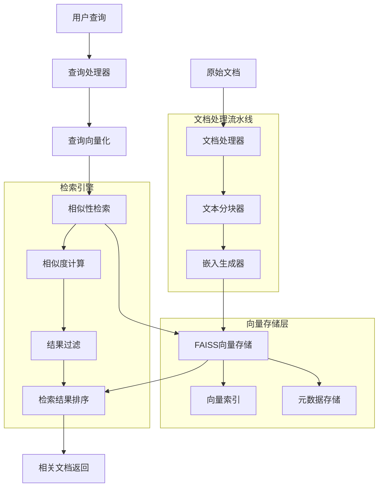

# RAG Vector Simple Architecture 简单向量检索系统架构文档

## 系统概述

**RAG Vector Simple** 是基于本地向量数据库的检索增强生成(RAG)系统，通过FAISS向量存储和HuggingFace嵌入模型实现文档块的向量化和相似性检索。系统从传统的Few-shot学习模式升级为知识检索增强模式，引入了向量化检索技术来扩展AI系统的知识边界。

### 核心特性
- **文档向量化**: 自动将文档切分为块并生成向量嵌入
- **本地向量存储**: 基于FAISS的高效本地向量数据库
- **语义相似性检索**: 通过向量相似度进行智能检索
- **多语言嵌入支持**: 使用HuggingFace多语言嵌入模型
- **增量索引构建**: 支持动态添加和更新文档向量

## 架构设计

### 整体架构图



## 核心组件设计

### 1. 文档处理器 (DocumentProcessor)

**功能职责**: 处理原始文档并准备向量化

```javascript
export class DocumentProcessor {
  constructor(options = {}) {
    this.supportedFormats = options.supportedFormats || ['.txt', '.json', '.md'];
    this.encoding = options.encoding || 'utf-8';
    this.maxFileSize = options.maxFileSize || 10 * 1024 * 1024; // 10MB
  }
  
  async processDocument(filePath) {
    // 1. 文件格式验证
    this.validateFileFormat(filePath);
    
    // 2. 文件大小检查
    await this.validateFileSize(filePath);
    
    // 3. 文档内容读取
    const content = await this.readDocumentContent(filePath);
    
    // 4. 文档元数据提取
    const metadata = await this.extractMetadata(filePath, content);
    
    // 5. 内容清理和标准化
    const cleanedContent = this.cleanContent(content);
    
    return {
      content: cleanedContent,
      metadata,
      source: filePath,
      processedAt: new Date().toISOString()
    };
  }
  
  async readDocumentContent(filePath) {
    const extension = path.extname(filePath).toLowerCase();
    
    switch (extension) {
      case '.txt':
      case '.md':
        return await fs.readFile(filePath, this.encoding);
        
      case '.json':
        const jsonContent = await fs.readFile(filePath, this.encoding);
        return this.extractTextFromJSON(JSON.parse(jsonContent));
        
      default:
        throw new Error(`Unsupported file format: ${extension}`);
    }
  }
  
  extractTextFromJSON(jsonData) {
    // 从JSON数据中提取文本内容
    if (Array.isArray(jsonData)) {
      return jsonData.map(item => this.extractTextFromObject(item)).join('\n\n');
    } else if (typeof jsonData === 'object') {
      return this.extractTextFromObject(jsonData);
    } else {
      return String(jsonData);
    }
  }
  
  extractTextFromObject(obj) {
    const textFields = [];
    
    for (const [key, value] of Object.entries(obj)) {
      if (typeof value === 'string' && value.trim()) {
        textFields.push(`${key}: ${value}`);
      } else if (typeof value === 'object' && value !== null) {
        textFields.push(this.extractTextFromObject(value));
      }
    }
    
    return textFields.join('\n');
  }
  
  cleanContent(content) {
    return content
      .replace(/\r\n/g, '\n')  // 统一换行符
      .replace(/\n{3,}/g, '\n\n')  // 合并多余空行
      .replace(/\s+/g, ' ')  // 合并多余空格
      .trim();
  }
}
```

### 2. 嵌入生成器 (EmbeddingGenerator)

**功能职责**: 使用HuggingFace模型生成文本向量嵌入

```javascript
import { HuggingFaceTransformersEmbeddings } from '@langchain/community/embeddings/hf_transformers';

export class EmbeddingGenerator {
  constructor(options = {}) {
    this.modelName = options.modelName || 'sentence-transformers/paraphrase-multilingual-MiniLM-L12-v2';
    this.cacheFolder = options.cacheFolder || './model-cache';
    this.batchSize = options.batchSize || 32;
    this.maxRetries = options.maxRetries || 3;
    
    this.embeddings = new HuggingFaceTransformersEmbeddings({
      modelName: this.modelName,
      cacheFolder: this.cacheFolder
    });
  }
  
  async generateEmbeddings(textChunks) {
    const results = [];
    
    // 批量处理文本块
    for (let i = 0; i < textChunks.length; i += this.batchSize) {
      const batch = textChunks.slice(i, i + this.batchSize);
      const batchResults = await this.processBatch(batch);
      results.push(...batchResults);
      
      // 显示进度
      console.log(`Processed ${Math.min(i + this.batchSize, textChunks.length)}/${textChunks.length} chunks`);
    }
    
    return results;
  }
  
  async processBatch(batch) {
    const batchTexts = batch.map(chunk => chunk.content);
    
    try {
      // 生成向量嵌入
      const embeddings = await this.embeddings.embedDocuments(batchTexts);
      
      // 组合文本块和向量
      return batch.map((chunk, index) => ({
        ...chunk,
        embedding: embeddings[index],
        embeddingDimension: embeddings[index].length,
        generatedAt: new Date().toISOString()
      }));
      
    } catch (error) {
      console.error('Batch processing failed:', error);
      
      // 单个处理作为fallback
      return await this.processBatchIndividually(batch);
    }
  }
  
  async generateQueryEmbedding(query) {
    try {
      return await this.embeddings.embedQuery(query);
    } catch (error) {
      console.error('Failed to generate query embedding:', error);
      throw error;
    }
  }
}
```

### 3. 向量存储管理器 (VectorStoreManager)

**功能职责**: 管理FAISS向量数据库的创建、更新和查询

```javascript
import { FaissStore } from '@langchain/community/vectorstores/faiss';
import { Document } from '@langchain/core/documents';

export class VectorStoreManager {
  constructor(options = {}) {
    this.storePath = options.storePath || './vector_store';
    this.indexName = options.indexName || 'documents';
    this.embeddingGenerator = options.embeddingGenerator;
    this.store = null;
  }
  
  async createVectorStore(embeddedChunks) {
    try {
      // 1. 准备文档和向量
      const documents = this.prepareDocuments(embeddedChunks);
      
      // 2. 创建FAISS存储
      this.store = await FaissStore.fromTexts(
        documents.map(doc => doc.pageContent),
        documents.map(doc => doc.metadata),
        this.embeddingGenerator.embeddings
      );
      
      // 3. 保存到磁盘
      await this.saveVectorStore();
      
      console.log(`Vector store created with ${documents.length} documents`);
      return this.store;
      
    } catch (error) {
      console.error('Failed to create vector store:', error);
      throw error;
    }
  }
  
  async loadVectorStore() {
    try {
      this.store = await FaissStore.load(
        this.storePath,
        this.embeddingGenerator.embeddings
      );
      
      console.log('Vector store loaded successfully');
      return this.store;
      
    } catch (error) {
      console.error('Failed to load vector store:', error);
      throw error;
    }
  }
  
  async similaritySearch(query, options = {}) {
    if (!this.store) {
      throw new Error('Vector store not initialized');
    }
    
    const {
      k = 5,
      scoreThreshold = 0.7,
      filter = null
    } = options;
    
    try {
      // 1. 执行相似性搜索
      const results = await this.store.similaritySearchWithScore(query, k, filter);
      
      // 2. 过滤低分结果
      const filteredResults = results.filter(([doc, score]) => score >= scoreThreshold);
      
      // 3. 格式化结果
      return filteredResults.map(([document, score]) => ({
        document: {
          content: document.pageContent,
          metadata: document.metadata
        },
        score,
        similarity: score,
        relevance: this.calculateRelevance(score)
      }));
      
    } catch (error) {
      console.error('Similarity search failed:', error);
      throw error;
    }
  }
  
  prepareDocuments(embeddedChunks) {
    return embeddedChunks
      .filter(chunk => chunk.embedding !== null)  // 过滤失败的嵌入
      .map(chunk => new Document({
        pageContent: chunk.content,
        metadata: {
          id: chunk.id,
          source: chunk.source,
          chunkIndex: chunk.chunkIndex,
          wordCount: chunk.wordCount,
          characterCount: chunk.characterCount,
          embeddingDimension: chunk.embeddingDimension,
          createdAt: chunk.createdAt,
          generatedAt: chunk.generatedAt
        }
      }));
  }
  
  calculateRelevance(score) {
    // 将相似性分数转换为相关性等级
    if (score >= 0.9) return 'very_high';
    if (score >= 0.8) return 'high';
    if (score >= 0.7) return 'medium';
    if (score >= 0.6) return 'low';
    return 'very_low';
  }
}
```

## 技术栈与工具

### 核心技术栈
- **Node.js**: 服务端JavaScript运行环境
- **LangChain**: AI应用开发框架
  - `@langchain/community`: 社区扩展包
  - `@langchain/core`: 核心抽象
- **FAISS**: Facebook AI相似性搜索库
- **HuggingFace Transformers**: 预训练嵌入模型

### 嵌入模型
- **默认模型**: `sentence-transformers/paraphrase-multilingual-MiniLM-L12-v2`
- **特点**: 多语言支持、轻量级、高效
- **向量维度**: 384维
- **支持语言**: 50+种语言

### 存储技术
- **向量数据库**: FAISS (本地文件存储)
- **元数据管理**: JSON格式存储
- **缓存机制**: 内存LRU缓存

## 性能优化策略

### 1. 批量处理优化

```javascript
// 批量嵌入生成
export class BatchEmbeddingOptimizer {
  constructor(batchSize = 32) {
    this.batchSize = batchSize;
    this.processingQueue = [];
    this.isProcessing = false;
  }
  
  async addToBatch(textChunk) {
    return new Promise((resolve, reject) => {
      this.processingQueue.push({
        chunk: textChunk,
        resolve,
        reject
      });
      
      this.processQueue();
    });
  }
  
  async processQueue() {
    if (this.isProcessing || this.processingQueue.length === 0) {
      return;
    }
    
    this.isProcessing = true;
    
    while (this.processingQueue.length > 0) {
      const batch = this.processingQueue.splice(0, this.batchSize);
      
      try {
        const results = await this.processBatch(batch);
        batch.forEach((item, index) => {
          item.resolve(results[index]);
        });
      } catch (error) {
        batch.forEach(item => {
          item.reject(error);
        });
      }
    }
    
    this.isProcessing = false;
  }
}
```

### 2. 查询缓存机制

```javascript
// 查询结果缓存
export class QueryCache {
  constructor(maxSize = 100, ttl = 3600000) { // 1小时TTL
    this.cache = new Map();
    this.maxSize = maxSize;
    this.ttl = ttl;
  }
  
  get(query) {
    const entry = this.cache.get(query);
    
    if (!entry) return null;
    
    if (Date.now() - entry.timestamp > this.ttl) {
      this.cache.delete(query);
      return null;
    }
    
    return entry.result;
  }
  
  set(query, result) {
    if (this.cache.size >= this.maxSize) {
      // LRU清理
      const firstKey = this.cache.keys().next().value;
      this.cache.delete(firstKey);
    }
    
    this.cache.set(query, {
      result,
      timestamp: Date.now()
    });
  }
}
```

## 安全性考虑

### 1. 输入验证

```javascript
export class InputValidator {
  static validateQuery(query) {
    // 长度限制
    if (query.length > 1000) {
      throw new Error('Query too long');
    }
    
    // 恶意内容检测
    const maliciousPatterns = [
      /<script/i,
      /javascript:/i,
      /on\w+\s*=/i
    ];
    
    for (const pattern of maliciousPatterns) {
      if (pattern.test(query)) {
        throw new Error('Potentially malicious query detected');
      }
    }
    
    return true;
  }
  
  static sanitizeText(text) {
    return text
      .replace(/<script\b[^<]*(?:(?!<\/script>)<[^<]*)*<\/script>/gi, '')
      .replace(/javascript:/gi, '')
      .replace(/on\w+\s*=/gi, '')
      .trim();
  }
}
```

## 可扩展性设计

### 1. 插件式嵌入模型

```javascript
// 嵌入模型插件接口
export class EmbeddingModelPlugin {
  constructor(modelName, options = {}) {
    this.modelName = modelName;
    this.options = options;
  }
  
  async initialize() {
    throw new Error('initialize() must be implemented');
  }
  
  async embedDocuments(texts) {
    throw new Error('embedDocuments() must be implemented');
  }
  
  async embedQuery(query) {
    throw new Error('embedQuery() must be implemented');
  }
  
  getDimension() {
    throw new Error('getDimension() must be implemented');
  }
}

// OpenAI嵌入插件示例
export class OpenAIEmbeddingPlugin extends EmbeddingModelPlugin {
  constructor(apiKey, options = {}) {
    super('text-embedding-ada-002', options);
    this.apiKey = apiKey;
  }
  
  async embedDocuments(texts) {
    const response = await openai.embeddings.create({
      model: this.modelName,
      input: texts
    });
    
    return response.data.map(item => item.embedding);
  }
  
  getDimension() {
    return 1536;  // Ada-002 维度
  }
}
```

## 学习价值与应用场景

### 1. 核心学习内容
- **RAG技术原理**: 检索增强生成的工作机制
- **向量化技术**: 文本嵌入和相似性计算
- **FAISS使用**: 高效向量相似性搜索
- **文档处理流水线**: 从原始文档到可搜索向量的完整流程

### 2. 实际应用场景
- **企业知识库**: 构建可搜索的企业文档系统
- **智能客服**: 基于文档的自动问答系统
- **学术研究**: 论文和文献的智能检索
- **内容推荐**: 基于语义相似性的内容推荐

### 3. 技术扩展方向
- **混合检索**: 结合关键词搜索和向量检索
- **多模态RAG**: 支持图像、音频等多媒体内容
- **实时更新**: 支持文档的实时索引更新
- **分布式存储**: 扩展到分布式向量数据库

## 总结

RAG Vector Simple系统通过引入向量化检索技术，实现了从基于规则的Few-shot学习到基于知识的检索增强生成的重要升级。该架构不仅提供了高效的文档检索能力，更建立了可扩展的知识管理框架，为构建智能知识系统奠定了坚实基础。

系统的创新亮点在于：
1. **完整的文档处理流水线**: 从原始文档到向量化的自动化处理
2. **高效的向量检索引擎**: 基于FAISS的快速相似性搜索
3. **可扩展的插件架构**: 支持多种嵌入模型和向量存储
4. **智能的查询优化**: 缓存、重排序、去重等优化策略

这为后续更高级的RAG应用开发提供了重要的技术基础和架构参考。 