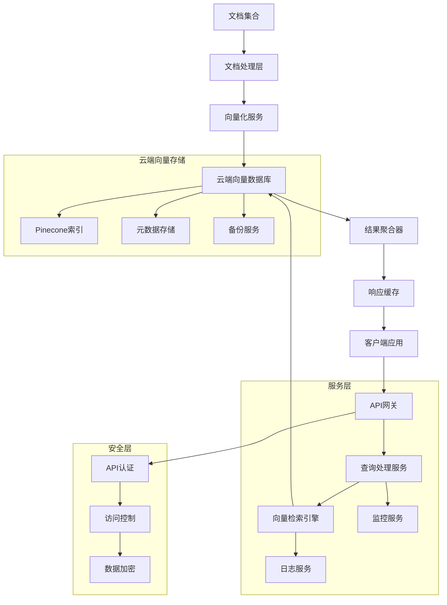

# RAG Vector Remote Architecture 远程向量数据库系统架构文档

## 系统概述

**RAG Vector Remote** 是基于云端向量数据库的企业级RAG系统，通过Pinecone等远程向量存储服务实现大规模文档的分布式存储和检索。系统从13-rag-vector-simple的本地向量存储升级为云端分布式架构，支持高可用性、水平扩展和企业级安全需求。

### 核心特性
- **云端向量数据库**: 基于Pinecone的分布式向量存储
- **分布式架构**: 支持多节点部署和负载均衡
- **企业级安全**: API密钥管理和访问控制
- **高可用性**: 云端服务保障和容错机制
- **水平扩展**: 支持百万级文档的向量存储

## 架构设计

### 整体架构图



## 核心组件设计

### 1. 远程向量存储管理器 (RemoteVectorStoreManager)

**功能职责**: 管理Pinecone等云端向量数据库的连接和操作

```javascript
import { PineconeStore } from '@langchain/community/vectorstores/pinecone';
import { Pinecone } from '@pinecone-database/pinecone';

export class RemoteVectorStoreManager {
  constructor(options = {}) {
    this.apiKey = options.apiKey || process.env.PINECONE_API_KEY;
    this.environment = options.environment || process.env.PINECONE_ENVIRONMENT;
    this.indexName = options.indexName || 'document-vectors';
    this.dimension = options.dimension || 384;
    this.metric = options.metric || 'cosine';
    this.embeddingGenerator = options.embeddingGenerator;
    
    this.pinecone = null;
    this.store = null;
    this.isConnected = false;
  }
  
  async initialize() {
    try {
      // 1. 初始化Pinecone客户端
      this.pinecone = new Pinecone({
        apiKey: this.apiKey,
        environment: this.environment
      });
      
      // 2. 检查或创建索引
      await this.ensureIndexExists();
      
      // 3. 初始化向量存储
      const index = this.pinecone.Index(this.indexName);
      this.store = new PineconeStore(this.embeddingGenerator.embeddings, {
        pineconeIndex: index
      });
      
      this.isConnected = true;
      console.log(`Connected to Pinecone index: ${this.indexName}`);
      
    } catch (error) {
      console.error('Failed to initialize remote vector store:', error);
      throw error;
    }
  }
  
  async ensureIndexExists() {
    try {
      // 检查索引是否存在
      const indexList = await this.pinecone.listIndexes();
      const indexExists = indexList.indexes?.some(index => index.name === this.indexName);
      
      if (!indexExists) {
        console.log(`Creating new index: ${this.indexName}`);
        
        await this.pinecone.createIndex({
          name: this.indexName,
          dimension: this.dimension,
          metric: this.metric,
          spec: {
            pod: {
              environment: this.environment,
              podType: 'p1.x1'
            }
          }
        });
        
        // 等待索引创建完成
        await this.waitForIndexReady();
      }
      
    } catch (error) {
      console.error('Failed to ensure index exists:', error);
      throw error;
    }
  }
  
  async waitForIndexReady(maxWaitTime = 300000) { // 5分钟
    const startTime = Date.now();
    
    while (Date.now() - startTime < maxWaitTime) {
      try {
        const indexStats = await this.pinecone.Index(this.indexName).describeIndexStats();
        if (indexStats) {
          console.log('Index is ready');
          return;
        }
      } catch (error) {
        // 索引可能还未准备好
      }
      
      await new Promise(resolve => setTimeout(resolve, 5000)); // 等待5秒
    }
    
    throw new Error('Index creation timeout');
  }
  
  async addDocuments(embeddedChunks, options = {}) {
    if (!this.isConnected) {
      throw new Error('Vector store not initialized');
    }
    
    const { batchSize = 100, namespace = '' } = options;
    
    try {
      // 批量上传文档
      for (let i = 0; i < embeddedChunks.length; i += batchSize) {
        const batch = embeddedChunks.slice(i, i + batchSize);
        
        const documents = batch.map(chunk => ({
          pageContent: chunk.content,
          metadata: {
            ...chunk.metadata,
            namespace,
            uploadedAt: new Date().toISOString()
          }
        }));
        
        await this.store.addDocuments(documents);
        
        console.log(`Uploaded batch ${Math.floor(i / batchSize) + 1}/${Math.ceil(embeddedChunks.length / batchSize)}`);
        
        // 避免API限速
        if (i + batchSize < embeddedChunks.length) {
          await new Promise(resolve => setTimeout(resolve, 1000));
        }
      }
      
      console.log(`Successfully uploaded ${embeddedChunks.length} documents`);
      
    } catch (error) {
      console.error('Failed to add documents:', error);
      throw error;
    }
  }
  
  async similaritySearch(query, options = {}) {
    if (!this.isConnected) {
      throw new Error('Vector store not initialized');
    }
    
    const {
      k = 5,
      scoreThreshold = 0.7,
      namespace = '',
      filter = {},
      includeMetadata = true
    } = options;
    
    try {
      const searchOptions = {
        k,
        filter: {
          ...filter,
          ...(namespace && { namespace })
        }
      };
      
      const results = await this.store.similaritySearchWithScore(query, k, searchOptions);
      
      // 过滤和格式化结果
      return results
        .filter(([doc, score]) => score >= scoreThreshold)
        .map(([document, score]) => ({
          content: document.pageContent,
          metadata: includeMetadata ? document.metadata : {},
          score,
          relevance: this.calculateRelevance(score),
          namespace: document.metadata.namespace || ''
        }))
        .sort((a, b) => b.score - a.score);
      
    } catch (error) {
      console.error('Similarity search failed:', error);
      throw error;
    }
  }
  
  async deleteDocuments(filter = {}, namespace = '') {
    if (!this.isConnected) {
      throw new Error('Vector store not initialized');
    }
    
    try {
      const index = this.pinecone.Index(this.indexName);
      
      const deleteRequest = {
        filter: {
          ...filter,
          ...(namespace && { namespace })
        }
      };
      
      await index.delete1(deleteRequest);
      
      console.log('Documents deleted successfully');
      
    } catch (error) {
      console.error('Failed to delete documents:', error);
      throw error;
    }
  }
  
  async getIndexStats() {
    if (!this.isConnected) {
      throw new Error('Vector store not initialized');
    }
    
    try {
      const index = this.pinecone.Index(this.indexName);
      const stats = await index.describeIndexStats();
      
      return {
        indexName: this.indexName,
        dimension: this.dimension,
        metric: this.metric,
        totalVectorCount: stats.totalVectorCount,
        namespaces: stats.namespaces || {},
        indexFullness: stats.indexFullness,
        environment: this.environment
      };
      
    } catch (error) {
      console.error('Failed to get index stats:', error);
      throw error;
    }
  }
  
  calculateRelevance(score) {
    if (score >= 0.9) return 'very_high';
    if (score >= 0.8) return 'high';
    if (score >= 0.7) return 'medium';
    if (score >= 0.6) return 'low';
    return 'very_low';
  }
}
```

### 2. 分布式查询处理器 (DistributedQueryProcessor)

**功能职责**: 处理分布式查询和负载均衡

```javascript
export class DistributedQueryProcessor {
  constructor(options = {}) {
    this.vectorStoreManagers = options.vectorStoreManagers || [];
    this.loadBalancer = new LoadBalancer(this.vectorStoreManagers);
    this.queryCache = new DistributedCache(options.cacheConfig);
    this.circuitBreaker = new CircuitBreaker(options.circuitBreakerConfig);
    this.retryPolicy = new RetryPolicy(options.retryConfig);
  }
  
  async query(userQuery, options = {}) {
    const queryId = this.generateQueryId();
    const startTime = Date.now();
    
    try {
      // 1. 检查缓存
      const cacheKey = this.generateCacheKey(userQuery, options);
      const cachedResult = await this.queryCache.get(cacheKey);
      
      if (cachedResult) {
        console.log(`Cache hit for query: ${queryId}`);
        return {
          ...cachedResult,
          cached: true,
          queryId,
          responseTime: Date.now() - startTime
        };
      }
      
      // 2. 分布式查询执行
      const results = await this.executeDistributedQuery(userQuery, options, queryId);
      
      // 3. 结果聚合和排序
      const aggregatedResults = await this.aggregateResults(results, options);
      
      // 4. 缓存结果
      await this.queryCache.set(cacheKey, aggregatedResults, options.cacheTTL);
      
      const responseTime = Date.now() - startTime;
      
      return {
        query: userQuery,
        results: aggregatedResults,
        totalResults: aggregatedResults.length,
        queryId,
        responseTime,
        cached: false,
        distributedQuery: true
      };
      
    } catch (error) {
      console.error(`Distributed query failed: ${queryId}`, error);
      throw error;
    }
  }
  
  async executeDistributedQuery(userQuery, options, queryId) {
    const { 
      parallelQueries = true, 
      maxConcurrency = 3,
      timeout = 30000 
    } = options;
    
    if (parallelQueries) {
      // 并行查询多个向量存储
      return await this.executeParallelQueries(userQuery, options, queryId, maxConcurrency, timeout);
    } else {
      // 串行查询（负载均衡）
      return await this.executeSerialQuery(userQuery, options, queryId);
    }
  }
  
  async executeParallelQueries(userQuery, options, queryId, maxConcurrency, timeout) {
    const queryPromises = this.vectorStoreManagers.map(async (manager, index) => {
      try {
        return await Promise.race([
          this.circuitBreaker.execute(async () => {
            return await this.retryPolicy.execute(async () => {
              return await manager.similaritySearch(userQuery, {
                ...options,
                queryId: `${queryId}-${index}`
              });
            });
          }),
          new Promise((_, reject) => 
            setTimeout(() => reject(new Error('Query timeout')), timeout)
          )
        ]);
      } catch (error) {
        console.error(`Query failed on manager ${index}:`, error);
        return [];
      }
    });
    
    // 限制并发数
    const results = await this.executeConcurrentlyWithLimit(queryPromises, maxConcurrency);
    
    return results.filter(result => Array.isArray(result) && result.length > 0);
  }
  
  async executeSerialQuery(userQuery, options, queryId) {
    const manager = await this.loadBalancer.getNextManager();
    
    try {
      const result = await this.circuitBreaker.execute(async () => {
        return await this.retryPolicy.execute(async () => {
          return await manager.similaritySearch(userQuery, {
            ...options,
            queryId
          });
        });
      });
      
      return [result];
      
    } catch (error) {
      console.error('Serial query failed:', error);
      throw error;
    }
  }
  
  async executeConcurrentlyWithLimit(promises, limit) {
    const results = [];
    
    for (let i = 0; i < promises.length; i += limit) {
      const batch = promises.slice(i, i + limit);
      const batchResults = await Promise.allSettled(batch);
      
      results.push(...batchResults.map(result => 
        result.status === 'fulfilled' ? result.value : []
      ));
    }
    
    return results;
  }
  
  async aggregateResults(resultSets, options = {}) {
    const { 
      maxResults = 20,
      diversityThreshold = 0.8,
      scoreFusion = 'rrf' // Reciprocal Rank Fusion
    } = options;
    
    // 1. 合并所有结果
    const allResults = [];
    resultSets.forEach((results, setIndex) => {
      results.forEach((result, resultIndex) => {
        allResults.push({
          ...result,
          sourceIndex: setIndex,
          originalRank: resultIndex,
          fusedScore: this.calculateFusedScore(result.score, resultIndex, scoreFusion)
        });
      });
    });
    
    // 2. 去重
    const uniqueResults = this.deduplicateResults(allResults, diversityThreshold);
    
    // 3. 重新排序
    uniqueResults.sort((a, b) => b.fusedScore - a.fusedScore);
    
    // 4. 限制结果数量
    return uniqueResults.slice(0, maxResults);
  }
  
  calculateFusedScore(originalScore, rank, fusionMethod) {
    switch (fusionMethod) {
      case 'rrf': // Reciprocal Rank Fusion
        return originalScore / (rank + 1);
      case 'weighted':
        return originalScore * Math.pow(0.9, rank);
      case 'linear':
        return originalScore - (rank * 0.01);
      default:
        return originalScore;
    }
  }
  
  deduplicateResults(results, threshold) {
    const uniqueResults = [];
    
    for (const result of results) {
      const isDuplicate = uniqueResults.some(unique => 
        this.calculateSimilarity(result.content, unique.content) > threshold
      );
      
      if (!isDuplicate) {
        uniqueResults.push(result);
      }
    }
    
    return uniqueResults;
  }
  
  calculateSimilarity(text1, text2) {
    // 简单的字符串相似度计算
    const words1 = new Set(text1.toLowerCase().split(/\s+/));
    const words2 = new Set(text2.toLowerCase().split(/\s+/));
    
    const intersection = new Set([...words1].filter(x => words2.has(x)));
    const union = new Set([...words1, ...words2]);
    
    return intersection.size / union.size;
  }
  
  generateQueryId() {
    return `query_${Date.now()}_${Math.random().toString(36).substr(2, 9)}`;
  }
  
  generateCacheKey(query, options) {
    const keyData = {
      query: query.toLowerCase().trim(),
      k: options.k || 5,
      scoreThreshold: options.scoreThreshold || 0.7,
      namespace: options.namespace || ''
    };
    
    return Buffer.from(JSON.stringify(keyData)).toString('base64');
  }
}
```

### 3. 负载均衡器 (LoadBalancer)

**功能职责**: 管理多个向量存储实例的负载分配

```javascript
export class LoadBalancer {
  constructor(managers, strategy = 'round-robin') {
    this.managers = managers;
    this.strategy = strategy;
    this.currentIndex = 0;
    this.healthStatus = new Map();
    this.responseStats = new Map();
    
    // 初始化健康状态
    this.managers.forEach((manager, index) => {
      this.healthStatus.set(index, { healthy: true, lastCheck: Date.now() });
      this.responseStats.set(index, { requests: 0, errors: 0, avgResponseTime: 0 });
    });
    
    // 启动健康检查
    this.startHealthCheck();
  }
  
  async getNextManager() {
    const healthyManagers = this.getHealthyManagers();
    
    if (healthyManagers.length === 0) {
      throw new Error('No healthy vector store managers available');
    }
    
    switch (this.strategy) {
      case 'round-robin':
        return this.getRoundRobinManager(healthyManagers);
      case 'least-connections':
        return this.getLeastConnectionsManager(healthyManagers);
      case 'weighted-response-time':
        return this.getWeightedResponseTimeManager(healthyManagers);
      case 'random':
        return this.getRandomManager(healthyManagers);
      default:
        return this.getRoundRobinManager(healthyManagers);
    }
  }
  
  getHealthyManagers() {
    return this.managers.filter((manager, index) => {
      const health = this.healthStatus.get(index);
      return health && health.healthy;
    });
  }
  
  getRoundRobinManager(healthyManagers) {
    const manager = healthyManagers[this.currentIndex % healthyManagers.length];
    this.currentIndex++;
    return manager;
  }
  
  getLeastConnectionsManager(healthyManagers) {
    let bestManager = healthyManagers[0];
    let leastConnections = Infinity;
    
    healthyManagers.forEach((manager, index) => {
      const stats = this.responseStats.get(index);
      if (stats && stats.requests < leastConnections) {
        leastConnections = stats.requests;
        bestManager = manager;
      }
    });
    
    return bestManager;
  }
  
  getWeightedResponseTimeManager(healthyManagers) {
    let bestManager = healthyManagers[0];
    let bestScore = Infinity;
    
    healthyManagers.forEach((manager, index) => {
      const stats = this.responseStats.get(index);
      if (stats) {
        // 综合考虑响应时间和错误率
        const score = stats.avgResponseTime * (1 + stats.errors / Math.max(stats.requests, 1));
        if (score < bestScore) {
          bestScore = score;
          bestManager = manager;
        }
      }
    });
    
    return bestManager;
  }
  
  getRandomManager(healthyManagers) {
    const randomIndex = Math.floor(Math.random() * healthyManagers.length);
    return healthyManagers[randomIndex];
  }
  
  recordRequest(managerIndex, responseTime, success = true) {
    const stats = this.responseStats.get(managerIndex);
    if (stats) {
      stats.requests++;
      if (!success) {
        stats.errors++;
      }
      
      // 更新平均响应时间
      stats.avgResponseTime = (stats.avgResponseTime * (stats.requests - 1) + responseTime) / stats.requests;
      
      this.responseStats.set(managerIndex, stats);
    }
  }
  
  async startHealthCheck() {
    setInterval(async () => {
      await this.performHealthCheck();
    }, 30000); // 每30秒检查一次
  }
  
  async performHealthCheck() {
    const healthCheckPromises = this.managers.map(async (manager, index) => {
      try {
        const startTime = Date.now();
        
        // 执行简单的健康检查查询
        await manager.getIndexStats();
        
        const responseTime = Date.now() - startTime;
        
        // 更新健康状态
        this.healthStatus.set(index, {
          healthy: true,
          lastCheck: Date.now(),
          responseTime
        });
        
        return { index, healthy: true, responseTime };
        
      } catch (error) {
        console.error(`Health check failed for manager ${index}:`, error);
        
        this.healthStatus.set(index, {
          healthy: false,
          lastCheck: Date.now(),
          error: error.message
        });
        
        return { index, healthy: false, error: error.message };
      }
    });
    
    const results = await Promise.allSettled(healthCheckPromises);
    
    const healthyCount = results.filter(result => 
      result.status === 'fulfilled' && result.value.healthy
    ).length;
    
    console.log(`Health check completed: ${healthyCount}/${this.managers.length} managers healthy`);
  }
  
  getStats() {
    return {
      strategy: this.strategy,
      totalManagers: this.managers.length,
      healthyManagers: this.getHealthyManagers().length,
      healthStatus: Object.fromEntries(this.healthStatus),
      responseStats: Object.fromEntries(this.responseStats)
    };
  }
  
  setStrategy(newStrategy) {
    this.strategy = newStrategy;
    console.log(`Load balancing strategy changed to: ${newStrategy}`);
  }
}
```

## 技术栈与工具

### 核心技术栈
- **Node.js**: 服务端JavaScript运行环境
- **LangChain**: AI应用开发框架
- **Pinecone**: 云端向量数据库服务
- **Redis**: 分布式缓存和会话存储

### 云端向量数据库
- **Pinecone**: 主要的云端向量存储服务
- **特点**: 高性能、可扩展、托管服务
- **索引类型**: Pod-based和Serverless索引
- **距离度量**: Cosine、Euclidean、Dotproduct

### 监控与运维
- **Prometheus**: 指标收集和监控
- **Grafana**: 监控面板和告警
- **ELK Stack**: 日志收集和分析

## 性能优化策略

### 1. 查询优化

```javascript
// 查询性能优化器
export class QueryOptimizer {
  constructor() {
    this.queryPatterns = new Map();
    this.performanceMetrics = new Map();
  }
  
  async optimizeQuery(query, options = {}) {
    // 1. 查询模式识别
    const pattern = this.identifyQueryPattern(query);
    
    // 2. 动态参数调整
    const optimizedOptions = this.adjustParameters(options, pattern);
    
    // 3. 预测最佳策略
    const strategy = this.predictBestStrategy(query, optimizedOptions);
    
    return {
      ...optimizedOptions,
      strategy,
      pattern
    };
  }
  
  identifyQueryPattern(query) {
    const words = query.toLowerCase().split(/\s+/);
    
    if (words.some(word => ['what', 'how', 'why', 'when'].includes(word))) {
      return 'question';
    } else if (words.some(word => ['find', 'search', 'get', 'show'].includes(word))) {
      return 'search';
    } else if (words.length > 10) {
      return 'complex';
    } else {
      return 'simple';
    }
  }
  
  adjustParameters(options, pattern) {
    const optimized = { ...options };
    
    switch (pattern) {
      case 'question':
        optimized.k = Math.min(optimized.k || 5, 10);
        optimized.scoreThreshold = 0.6;
        break;
      case 'search':
        optimized.k = Math.max(optimized.k || 5, 8);
        optimized.scoreThreshold = 0.7;
        break;
      case 'complex':
        optimized.k = Math.max(optimized.k || 5, 15);
        optimized.scoreThreshold = 0.5;
        break;
      case 'simple':
        optimized.k = Math.min(optimized.k || 5, 5);
        optimized.scoreThreshold = 0.8;
        break;
    }
    
    return optimized;
  }
}
```

### 2. 缓存策略

```javascript
// 多层缓存管理器
export class MultiLayerCache {
  constructor(options = {}) {
    this.l1Cache = new Map(); // 内存缓存
    this.l2Cache = options.redisClient; // Redis缓存
    this.l3Cache = options.dbClient; // 数据库缓存
    
    this.l1MaxSize = options.l1MaxSize || 1000;
    this.l2TTL = options.l2TTL || 3600; // 1小时
    this.l3TTL = options.l3TTL || 86400; // 24小时
  }
  
  async get(key) {
    // L1缓存（内存）
    if (this.l1Cache.has(key)) {
      return this.l1Cache.get(key);
    }
    
    // L2缓存（Redis）
    if (this.l2Cache) {
      const l2Result = await this.l2Cache.get(key);
      if (l2Result) {
        const data = JSON.parse(l2Result);
        this.setL1(key, data);
        return data;
      }
    }
    
    // L3缓存（数据库）
    if (this.l3Cache) {
      const l3Result = await this.l3Cache.getCachedQuery(key);
      if (l3Result) {
        this.setL1(key, l3Result);
        if (this.l2Cache) {
          await this.l2Cache.setex(key, this.l2TTL, JSON.stringify(l3Result));
        }
        return l3Result;
      }
    }
    
    return null;
  }
  
  async set(key, value, ttl) {
    // 设置到所有缓存层
    this.setL1(key, value);
    
    if (this.l2Cache) {
      await this.l2Cache.setex(key, ttl || this.l2TTL, JSON.stringify(value));
    }
    
    if (this.l3Cache) {
      await this.l3Cache.setCachedQuery(key, value, ttl || this.l3TTL);
    }
  }
  
  setL1(key, value) {
    if (this.l1Cache.size >= this.l1MaxSize) {
      // LRU清理
      const firstKey = this.l1Cache.keys().next().value;
      this.l1Cache.delete(firstKey);
    }
    
    this.l1Cache.set(key, value);
  }
}
```

## 安全性设计

### 1. API安全管理

```javascript
// API安全管理器
export class APISecurityManager {
  constructor(options = {}) {
    this.apiKeys = new Map();
    this.rateLimiter = new RateLimiter(options.rateLimitConfig);
    this.encryption = new EncryptionService(options.encryptionConfig);
    this.auditLogger = new AuditLogger(options.auditConfig);
  }
  
  async authenticateRequest(request) {
    const apiKey = this.extractAPIKey(request);
    
    if (!apiKey) {
      throw new UnauthorizedError('Missing API key');
    }
    
    const keyInfo = await this.validateAPIKey(apiKey);
    
    if (!keyInfo) {
      await this.auditLogger.logFailedAuth(request, 'Invalid API key');
      throw new UnauthorizedError('Invalid API key');
    }
    
    // 检查速率限制
    const rateLimitResult = await this.rateLimiter.checkLimit(keyInfo.userId, request);
    
    if (!rateLimitResult.allowed) {
      await this.auditLogger.logRateLimit(request, keyInfo);
      throw new TooManyRequestsError('Rate limit exceeded');
    }
    
    await this.auditLogger.logSuccessfulAuth(request, keyInfo);
    
    return keyInfo;
  }
  
  async validateAPIKey(apiKey) {
    // 验证API密钥格式
    if (!this.isValidKeyFormat(apiKey)) {
      return null;
    }
    
    // 检查密钥是否存在且有效
    const keyInfo = this.apiKeys.get(apiKey);
    
    if (!keyInfo) {
      return null;
    }
    
    // 检查密钥是否过期
    if (keyInfo.expiresAt && Date.now() > keyInfo.expiresAt) {
      return null;
    }
    
    // 检查密钥权限
    if (!keyInfo.permissions.includes('vector_search')) {
      return null;
    }
    
    return keyInfo;
  }
  
  generateAPIKey(userId, permissions = ['vector_search']) {
    const apiKey = this.encryption.generateSecureKey();
    
    const keyInfo = {
      userId,
      permissions,
      createdAt: Date.now(),
      expiresAt: Date.now() + (365 * 24 * 60 * 60 * 1000), // 1年
      usage: {
        requests: 0,
        lastUsed: null
      }
    };
    
    this.apiKeys.set(apiKey, keyInfo);
    
    return {
      apiKey,
      keyInfo
    };
  }
  
  isValidKeyFormat(apiKey) {
    // API密钥格式验证
    return /^pk-[a-zA-Z0-9]{32}$/.test(apiKey);
  }
  
  extractAPIKey(request) {
    // 从请求头中提取API密钥
    return request.headers['x-api-key'] || 
           request.headers['authorization']?.replace('Bearer ', '');
  }
}
```

## 学习价值与应用场景

### 1. 核心学习内容
- **云端向量数据库**: Pinecone等云服务的使用
- **分布式架构**: 多节点部署和负载均衡
- **企业级安全**: API管理和访问控制
- **性能优化**: 缓存、查询优化、监控

### 2. 实际应用场景
- **大型企业知识库**: 支持百万级文档的检索
- **多租户SaaS平台**: 分命名空间的数据隔离
- **高并发搜索服务**: 分布式查询处理
- **企业级AI服务**: 安全可控的AI知识检索

### 3. 技术扩展方向
- **多云部署**: 支持多个云厂商的向量数据库
- **边缘计算**: 本地缓存与云端同步
- **实时同步**: 多地域数据一致性
- **智能运维**: 自动化监控和故障恢复

## 总结

RAG Vector Remote系统通过引入云端向量数据库和分布式架构，实现了从本地向量存储到企业级云端服务的重要升级。该架构不仅提供了高可用性和水平扩展能力，更建立了完整的企业级安全和运维体系。

系统的创新亮点在于：
1. **云原生架构**: 基于Pinecone的分布式向量存储
2. **高可用设计**: 多节点部署和故障转移机制  
3. **企业级安全**: 完整的API管理和访问控制
4. **智能负载均衡**: 多策略的查询分发和性能优化

这为构建大规模、高可用的企业级RAG服务提供了完整的技术方案和最佳实践参考。 